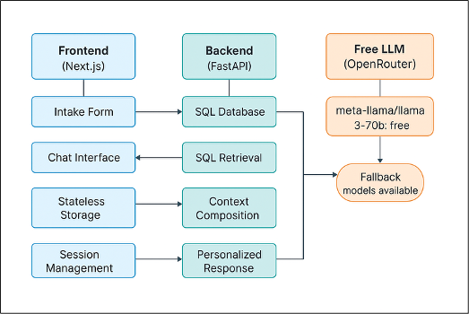

[](Guide.md)

# **BoBeutician - Skincare Recommendation System**

BoBeutician is a web-based tool designed to help users find the best skincare products for their skin type and concerns, while highlighting proper product use and important ingredients.

---

## **User Flow**

1. **User visits site** → Frontend loads
2. **Completes intake form** → Data saved to `sessionStorage`
3. **Asks skincare question** → Chat hook processes
4. **Backend receives request** → SQL retrieval pipeline executes:
   - Extracts user attributes (skin type, concerns)
   - Queries SQL database for relevant products
   - Retrieves beneficial ingredients
   - Composes personalized context
   - Calls free LLM with optimized prompt
5. **AI responds** → Personalized recommendation returned
6. **Frontend updates** → Chat UI shows response with confidence
7. **User closes tab** → All data automatically cleared

For additional detail, see **Guide.md**.

---

## **Technical Architecture**

---



---

### Frontend (Next.js)

- Intake Form
- Chat Interface
- Stateless Storage
- Session Management

### Backend (FastAPI)

- SQL Database
- SQL Retrieval
- Context Composition
- Personalized Responses

### LLM Layer (OpenRouter)

- meta-llama/llama 3-70b (free)
- Fallback models available

---

## Languages and Libraries

### Frontend 

- React
- Next.js
- TypeScript
- Tailwind
- Jest (testing)
- Fetch base API helper
- Zod (Schema)

### Backend

- Python
- Alembic
- FastAPI
- SQLAlchemyORM
- Uvicorn
- Python Dotenv
- Pydantic
- Pytest
  (testing)
- Fast API TestClient (testing)

---

# **Installation Instructions**

## **Quick Start**

### **1. Setup**

```bash
# Reopen Dev Container in VS Code
# Click the >< icon in bottom-left → “Reopen in Dev Container”
# This should start up the frontend server

# Add your free OpenRouter API key
echo "OPENROUTER_API_KEY=your_free_api_key_here" >> .env

# Seed the database
python scripts/seed_db.py

# Start backend server
uvicorn app.main:app --host 0.0.0.0 --port 8000

# Frontend will appear on port 3000 (view in VS Code ports panel)
```

## Group Members and Roles:

**Isabella Marquez:** Frontend and Backend
**Grace Sletten:** Webdesign and frontend
**Vince Beltran:** Backend
**Jamon Graham:** Frontend
